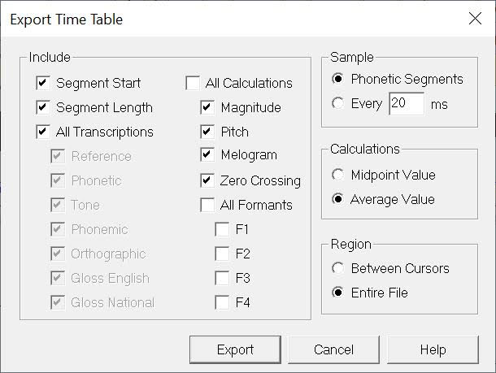
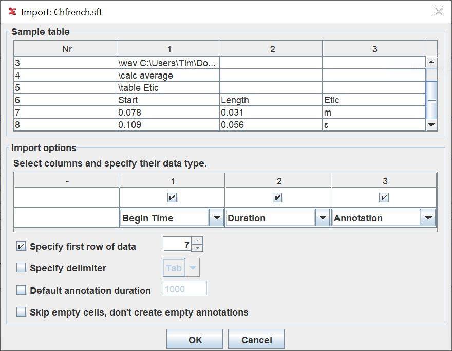

# How to convert from Speech Analyzer ".saxml" to ELAN ".EAF" files and to Praat ".TextGrid" files. 

In Speech Analyzer export to Time Table / SFT standard format time table which is a tab delimited data within a standard format file. When you export, you need to ensure that you have region set as "entire file".  Note that this isn't very good for exporting words because it will always do segment time-intervals not word time-intervals. So it might be best to just select phonetic transcription.

You can then load this in ELAN (I think the filename has to end in .txt otherwise ELAN complains that it's not a valid file)

If this loads correctly, you can now Use File > Export as > Praat TextGrid file
